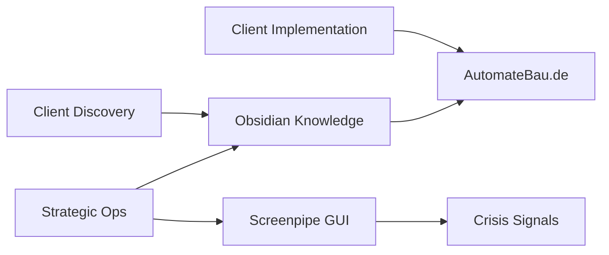

# Linear Strategic Dashboard - Dynamic

## Live Project Status

```dataview
TABLE 
  project-status,
  revenue-impact,
  progress + "%",
  target-date,
  key-blockers
FROM #linear-project
SORT revenue-impact DESC, progress ASC
```

## Revenue Progress Tracking

```dataview
TABLE 
  revenue-target,
  revenue-current,
  (revenue-current / revenue-target * 100) + "%" as completion
FROM #revenue-tracking
WHERE revenue-target > 0
```

## Critical Path Analysis

```dataview
LIST
FROM #linear-project 
WHERE contains(labels, "High Revenue") AND contains(status, "Blocked")
```

## Strategic Connections Map



---
*Last Updated: {{date:YYYY-MM-DD HH:mm}}*
*Auto-generated from Linear API*