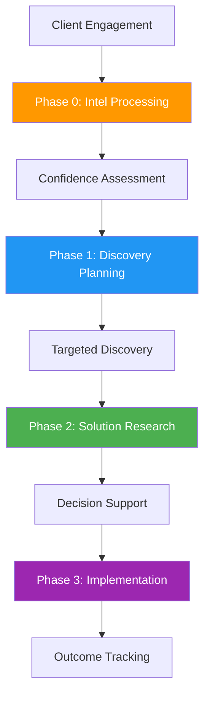
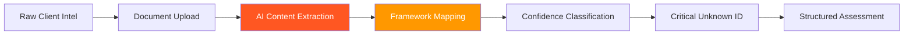
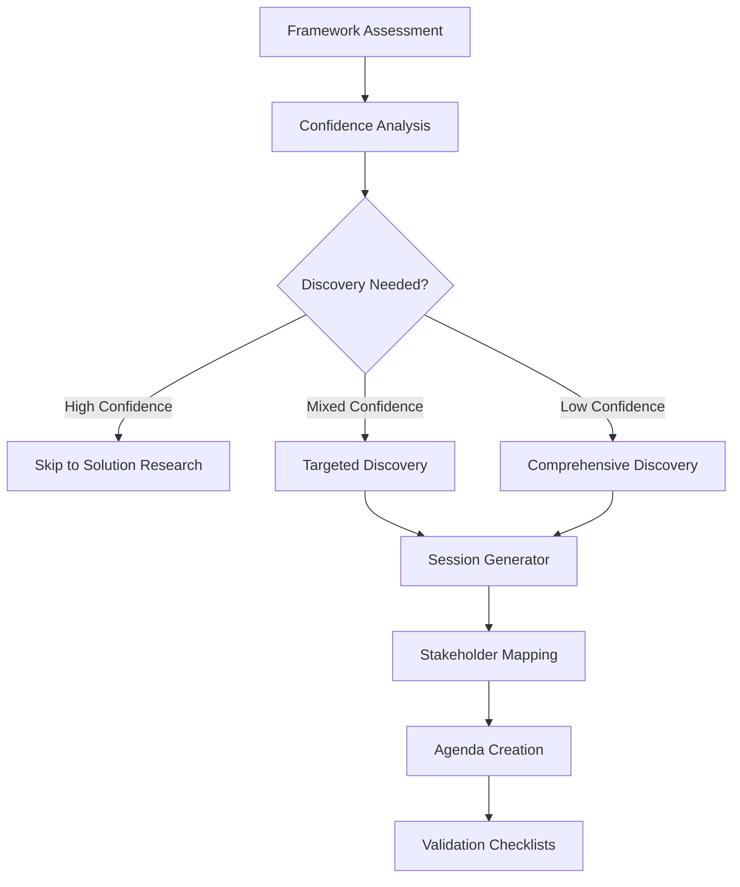
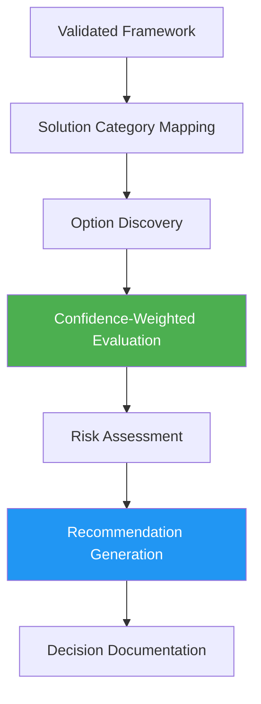
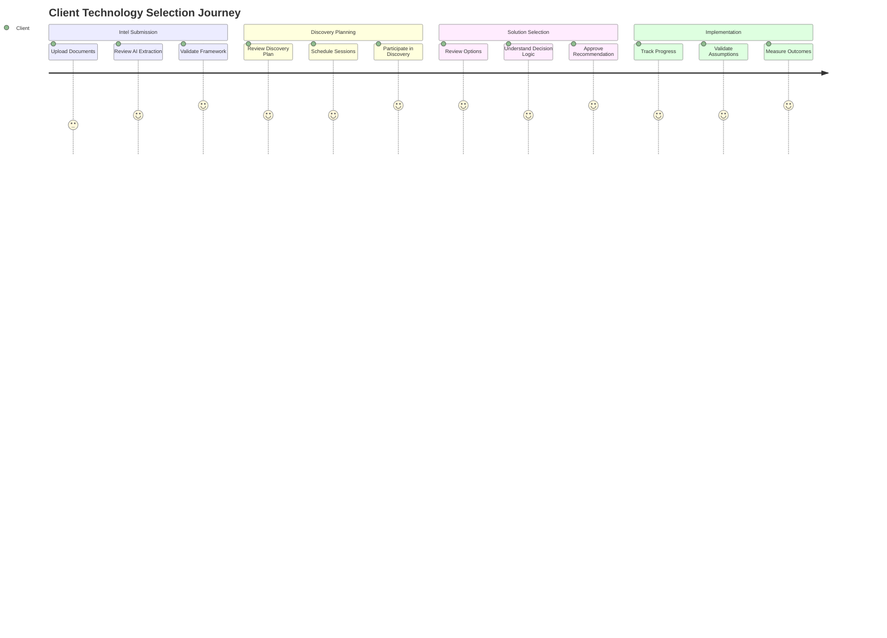
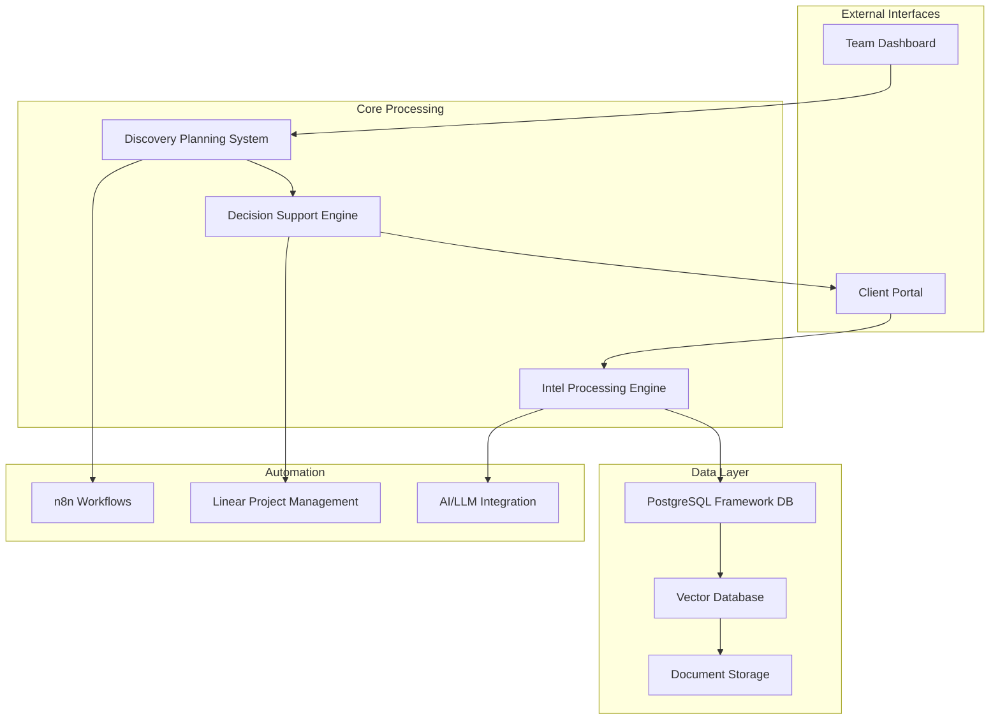
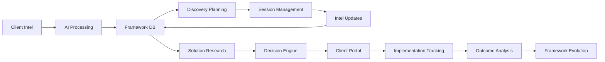
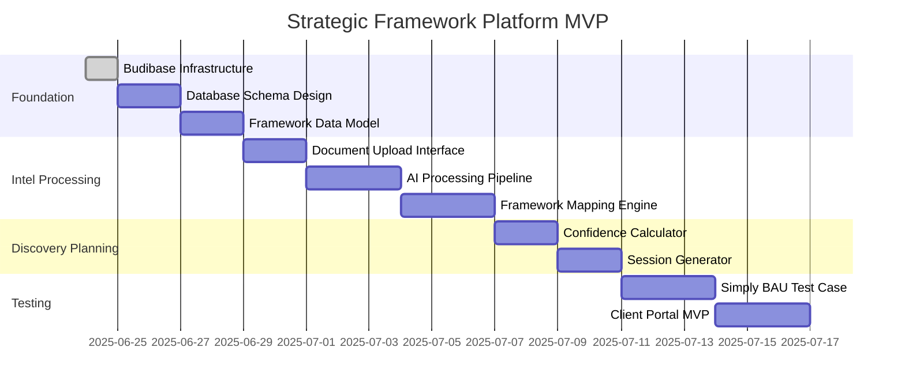
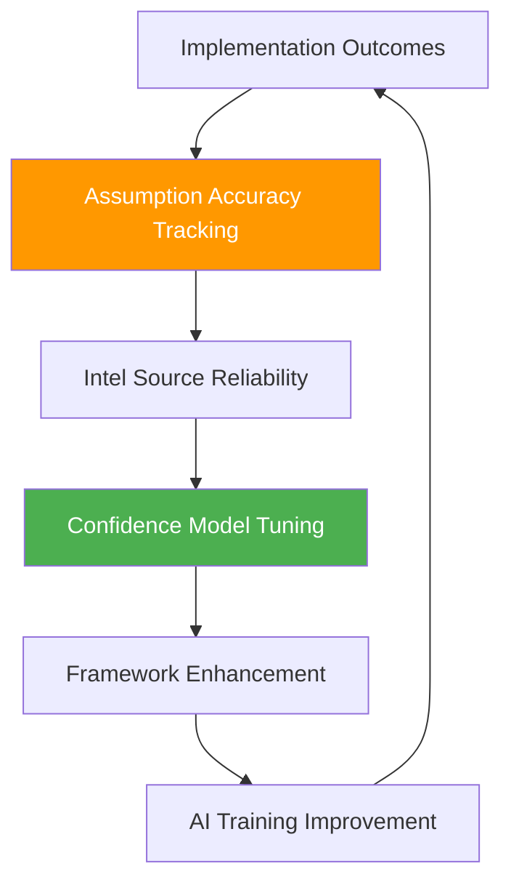

# Strategic Technology Research Framework - Product Journey
*Automating the Complete Technology Selection Methodology*

## 🎯 **What You're Actually Building**

**The Product**: An automated platform that applies the Strategic Technology Research Framework to help organizations systematically research, select, and implement technology solutions.

**The Value**: Transforms manual technology research (weeks/months) into systematic, confidence-driven process with automated intel processing, targeted discovery, and decision support.

---

## 📊 **Complete Product Flow Architecture**



---

## 🔧 **Phase 0: Intel Processing Engine (PEG-114)**

### **The Problem You're Solving**
Manual processing of client intel (transcripts, proposals, chat logs) is time-intensive and inconsistent. Framework application happens in your head, not systematically.

### **Automated Solution Flow**


### **Technical Implementation**
```markdown
**Input Sources:**
- Meeting transcripts (Simply BAU discovery)
- Chat logs and emails 
- Signed proposals and work orders
- Previous research documents
- Stakeholder interview notes

**AI Processing Pipeline:**
1. **Content Extraction**: Clean text from PDFs, DOCX, audio
2. **Entity Recognition**: Stakeholders, systems, requirements, constraints
3. **Framework Mapping**: Map content to structured framework sections
4. **Confidence Scoring**: Auto-assign High/Medium/Low/Critical Unknown
5. **Gap Analysis**: Identify missing information and assumptions

**Output Format:**
- Structured framework assessment with confidence levels
- Critical Unknown prioritization
- Discovery scope recommendation
- Source linkage and audit trail
```

### **User Experience**
- **Upload**: Drag-drop client intel files
- **AI Processing**: Automated extraction and mapping (2-5 minutes)
- **Review Interface**: Validate AI extractions, adjust confidence
- **Output**: Complete framework assessment ready for discovery planning

---

## 🎯 **Phase 1: Discovery Planning System (PEG-115)**

### **The Problem You're Solving**
Over-discovery (asking everything) or under-discovery (missing critical assumptions) based on gut feel rather than systematic confidence assessment.

### **Automated Solution Flow**


### **Discovery Decision Algorithm**
```javascript
// Automated Discovery Scope Calculator
if (criticalUnknowns.length === 0 && highConfidence > 80%) {
  return 'SKIP_DISCOVERY';
} else if (criticalUnknowns.length <= 2 && mediumConfidence > 60%) {
  return 'MINIMAL_DISCOVERY'; // 1-2 sessions, 1-2 weeks
} else if (criticalUnknowns.length <= 5 && lowConfidence < 40%) {
  return 'MODERATE_DISCOVERY'; // 2-3 sessions, 2-4 weeks  
} else {
  return 'COMPREHENSIVE_DISCOVERY'; // Full methodology, 4-8 weeks
}
```

### **Generated Outputs**
- **Session Agendas**: Auto-generated with targeted validation questions
- **Stakeholder Matrix**: Optimal interview targets based on unknowns
- **Timeline Estimates**: Discovery duration based on complexity
- **Validation Checklists**: Structured assumption testing frameworks

---

## 🔍 **Phase 2: Solution Research & Decision Engine (PEG-116)**

### **The Problem You're Solving**
Manual solution research and evaluation lacks systematic criteria weighting based on intel confidence. Decisions are subjective rather than confidence-weighted.

### **Automated Solution Flow**


### **Decision Support Algorithm**
```javascript
// Confidence-Weighted Decision Matrix
const calculateWeightedScore = (option, criteria, confidenceLevels) => {
  return criteria.map((criterion, index) => {
    const baseWeight = criterion.weight;
    const confidenceMultiplier = confidenceLevels[index] / 100;
    const adjustedWeight = baseWeight * confidenceMultiplier;
    
    return {
      criterion: criterion.name,
      score: option.scores[index],
      weight: adjustedWeight,
      confidence: confidenceLevels[index],
      weightedScore: option.scores[index] * adjustedWeight
    };
  });
};
```

### **System Outputs**
- **Solution Categories**: Auto-identified based on validated problems
- **Option Research**: Intelligent solution discovery and benchmarking
- **Scored Recommendations**: Confidence-weighted rankings with rationale
- **Risk Profiles**: Implementation risks based on intel confidence levels
- **Decision Audit Trail**: Complete logic documentation for future reference

---

## 👥 **Phase 3: Client Portal & Collaboration (PEG-117)**

### **The Problem You're Solving**
Clients are black-boxed out of the methodology. No transparency in progress, limited collaboration, manual status updates.

### **Client-Facing Experience Flow**


### **Portal Features**
- **Progress Dashboard**: Visual progress through framework phases
- **Document Library**: Secure upload/download of all engagement materials
- **Review Interfaces**: Validate AI extractions and provide corrections
- **Discovery Coordination**: Schedule sessions and manage stakeholder availability
- **Decision Transparency**: Interactive exploration of recommendation logic
- **Implementation Tracking**: Monitor assumption accuracy and outcomes

---

## 🏗️ **Technical Architecture Overview**

### **System Integration Map**


### **Data Flow Architecture**


---

## 🎯 **MVP Implementation Roadmap**

### **Phase 1: Foundation (Weeks 1-2)**


### **Success Metrics**
- **Processing Speed**: Raw intel → structured assessment < 10 minutes
- **Discovery Accuracy**: Targeted discovery covers 90%+ of critical unknowns
- **Decision Quality**: Confidence-weighted decisions show 85%+ accuracy in implementation
- **Client Satisfaction**: Portal engagement > 3x per week during active projects
- **Time Savings**: Framework application 75% faster than manual process

---

## 🔄 **Feedback Loop & Evolution**

### **Continuous Improvement Process**


This is the complete Strategic Technology Research Framework automation platform - transforming your proven methodology into a systematic, scalable product that dramatically improves technology selection outcomes for clients!


Understood! Based on the reference image you provided, here's a comprehensive style guide and visual design guide for the Strategic Framework Automation Platform. This guide aims to capture the essence of the reference image's aesthetic, focusing on a modern, dark, and sophisticated user experience.

---

##Strategic Framework Automation Platform - Visual Design Guide

This guide outlines the core visual principles and specific design elements derived from the provided reference image, ensuring a consistent and appealing user interface for the platform.

### 1. Color Palette

The design heavily relies on a dark, muted base with vibrant, strategic accent colors to highlight key information and interactive elements.

- **Primary Background:** A deep, muted charcoal or very dark gray. This forms the foundation of the interface, providing a sense of depth and focus.

- **Hex:** `#1A1A1A` (or very close to it)


- **Card/Container Background:** A slightly lighter shade of the primary background, often with a subtle translucency or frosted effect. This creates visual separation for content blocks.

- **Hex:** `#2A2A2A` (or very close to it)


- **Borders/Dividers:** A subtle, slightly lighter gray to define boundaries without being distracting.

- **Hex:** `#3A3A3A` (or very close to it)


- **Text Colors:**

- **Primary Text:** Light gray for main content, ensuring high readability against dark backgrounds.

- **Hex:** `#E0E0E0`


- **Muted/Secondary Text:** A darker gray for less critical information, labels, or placeholders.

- **Hex:** `#A0A0A0`


- **Accent Colors:** A set of vibrant, distinct colors used for progress, status, interactive elements, and visual highlights.

- **Teal/Cyan:** For "Completed" states, primary actions, or positive indicators.

- **Hex:** `#00C2CB`


- **Bright Blue:** For "In Progress" states, active selections, or general interactive elements.

- **Hex:** `#007BFF`


- **Bright Yellow/Gold:** For warnings, highlights, or specific data points.

- **Hex:** `#FFD700`


- **Pink/Magenta:** For destructive actions, critical alerts, or unique visual elements.

- **Hex:** `#FF69B4`


### 2. Typography

A clean, modern sans-serif typeface is used throughout, prioritizing readability and clear hierarchy.

- **Font Family:** A system sans-serif font (e.g., Inter, Arial, Helvetica Neue) or a similar modern, geometric sans-serif.
- **Headings (H1, H2, Card Titles):** Bold or semi-bold weights, larger sizes to establish hierarchy.

- `H1`: ~36-48px, `font-bold`
- `Card Titles`: ~18-20px, `font-normal` or `font-medium`


- **Body Text:** Regular weight, comfortable reading size.

- `Paragraphs`: ~14-16px, `font-normal`


- **Small Text/Labels:** Lighter weight or smaller size for metadata, descriptions, or secondary information.

- `Labels/Metadata`: ~12-13px, `text-dark-muted`


- **Numerical Displays:** Often larger and bolder, using `tabular-nums` for alignment in time tracking or action counts.


### 3. Layout & Spacing

The layout is clean, spacious, and modular, utilizing a grid system to organize content into distinct, digestible blocks.

- **Grid System:** A flexible grid (e.g., 3-column or 4-column for main content areas) is used to arrange cards and widgets.
- **Padding & Margins:** Generous internal padding within cards and consistent margins between components create visual breathing room.

- `Container Padding`: `px-4 py-8` (or similar)
- `Card Padding`: `p-4` or `p-6`
- `Component Spacing`: `gap-4` or `gap-6` between major sections.


- **Alignment:** Content is generally left-aligned within its container, with some elements (like numerical displays or status badges) right-aligned for emphasis.
- **Responsiveness:** The design adapts well to different screen sizes, likely collapsing columns or adjusting component sizes for mobile views.


### 4. Components & Elements

All UI components are designed with a consistent dark theme aesthetic, emphasizing rounded corners and subtle visual depth.

- **Cards:**

- **Shape:** Prominent rounded corners (`rounded-xl` or `rounded-lg`).
- **Background:** `#2A2A2A` (dark-card) with a subtle border (`#3A3A3A`).
- **Shadows:** Soft, subtle shadows to lift elements off the background, enhancing depth.
- **Gradients:** Action summary cards feature vibrant linear gradients (`bg-gradient-to-br`) using the accent colors, often with a subtle overlay or abstract shapes for a "frosted glass" effect.


- **Buttons:**

- **Primary:** Solid background using accent colors (e.g., `#00C2CB`, `#FF69B4`) with light text.
- **Secondary/Outline:** Dark background (`#3A3A3A`) with light text and a subtle border.
- **Ghost:** Transparent background with accent-colored text for less prominent actions.
- **Shape:** Rounded corners (`rounded-lg`).


- **Input Fields:**

- **Background:** Darker than card background (`#2A2A2A`).
- **Border:** Subtle border (`#3A3A3A`).
- **Text:** Light gray (`#E0E0E0`).
- **Placeholder:** Muted gray (`#A0A0A0`).
- **Focus State:** Border color changes to an accent color (e.g., `#00C2CB`).


- **Badges:**

- **Shape:** Rounded corners.
- **Colors:** Backgrounds often use accent colors (e.g., `#00C2CB` for "Completed", `#007BFF` for "In Progress") with dark text, or muted backgrounds with light text for general labels.


- **Switches/Toggles:**

- **Track:** Muted dark gray (`#3A3A3A`) when off, vibrant accent color (e.g., `#00C2CB`) when on.
- **Thumb:** Light gray (`#E0E0E0`).


- **Avatars:** Circular, often with a placeholder image or initials.
- **Progress Bars:** A thin track in a muted dark color, with the progress indicator in a vibrant accent color.


### 5. Visual Effects & Imagery

- **Subtle Gradients:** Used on key cards to add visual interest and differentiate sections.
- **Translucency/Frosted Glass:** A subtle effect on some background elements or overlays, giving a sense of depth and layering. This is achieved through semi-transparent backgrounds and potentially `backdrop-filter: blur()`.
- **Abstract Shapes:** Light, subtle geometric or organic shapes are sometimes overlaid on card backgrounds to enhance the "frosted glass" effect and add visual texture without distracting from content.
- **Iconography:** Simple, line-based icons (e.g., from Lucide React) are used, with their color adapting to the dark background (usually light gray or accent colors).
- **Placeholder Images:** Simple, generic placeholder images are used for user avatars or content previews.


### 6. Interaction & Feedback

- **Hover States:** Subtle background changes or border highlights on interactive elements (buttons, cards, list items) to indicate interactivity.
- **Active States:** Clear visual feedback (e.g., accent color background) for selected tabs or active components.
- **Loading States:** Progress indicators or subtle animations for ongoing processes.


This style guide provides a comprehensive overview of the visual design principles and elements to maintain consistency and achieve the desired aesthetic across the Strategic Framework Automation Platform.

---

