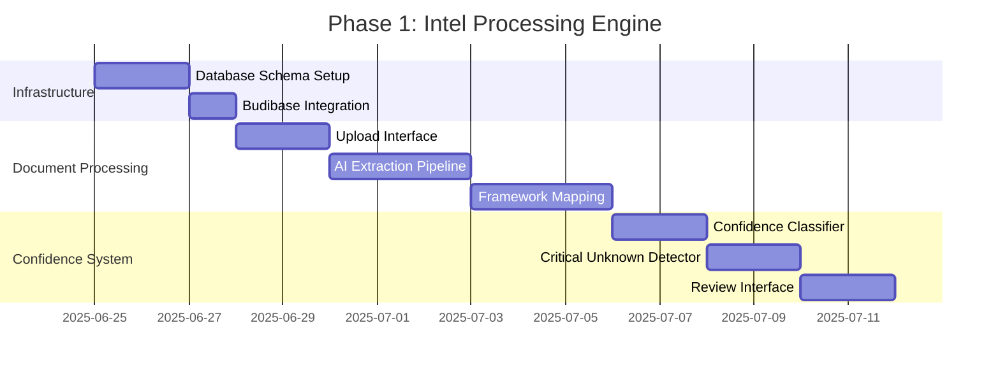
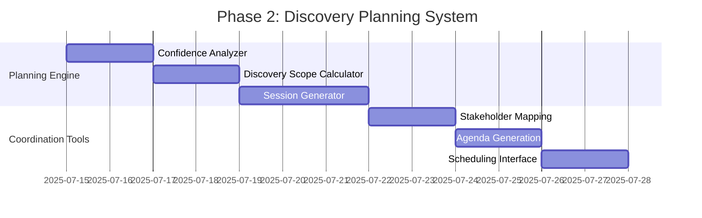
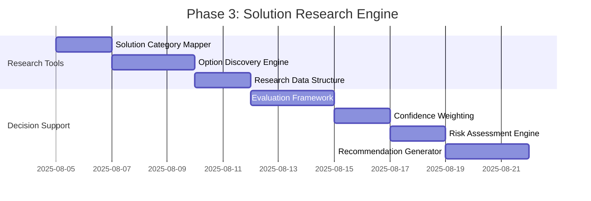
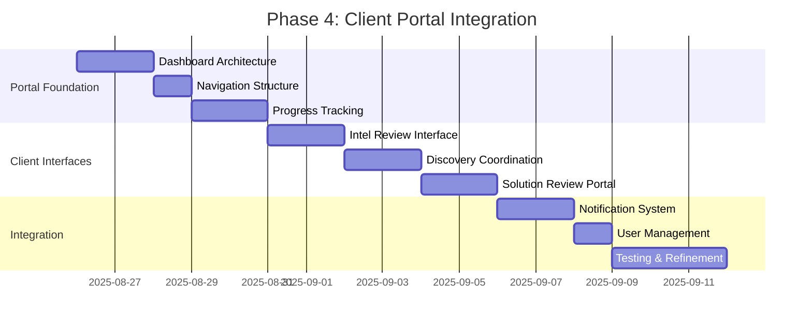

# Strategic Framework Platform - MVP Development Roadmap
*Complete Implementation Plan for Technology Research Automation*

## 🎯 **MVP Scope Definition**

**Core Objective**: Build minimum viable platform that automates the Strategic Technology Research Framework application from intel processing through recommendation generation.

**Target Outcome**: Transform Simply BAU engagement from manual framework application to systematic, automated process with client portal transparency.

---

## 📊 **Development Phases Breakdown**

### **Phase 1: Intel Processing Foundation (Weeks 1-3)**
*Building PEG-114: Intel Processing Engine*

**Week 1 Deliverables:**
- PostgreSQL framework database schema implemented
- Budibase app created with basic tables (framework_assessments, framework_sections, critical_unknowns)
- Document upload interface with file storage

**Week 2 Deliverables:**
- AI content extraction pipeline (PDF, DOCX, TXT support)
- Framework mapping engine with section classification
- Basic entity recognition (stakeholders, systems, requirements)

**Week 3 Deliverables:**
- Confidence level classification (High/Medium/Low/Critical Unknown)
- Critical Unknown detection algorithm
- Review interface for human validation and adjustment

### **Phase 2: Discovery Planning Automation (Weeks 4-6)**
*Building PEG-115: Discovery Planning System*

**Week 4 Deliverables:**
- Confidence analysis algorithm (distribution calculation)
- Discovery scope decision tree (Skip/Minimal/Moderate/Comprehensive)
- Discovery timeline estimation based on Critical Unknowns

**Week 5 Deliverables:**
- Automated session agenda generation
- Stakeholder mapping based on unknowns
- Validation checklist creation for assumptions

**Week 6 Deliverables:**
- Discovery session management interface
- Session scheduling and coordination tools
- Progress tracking for discovery execution

### **Phase 3: Solution Research Engine (Weeks 7-10)**
*Building PEG-116: Solution Research & Decision Support*

**Week 7 Deliverables:**
- Solution category mapping based on validated problems
- Option discovery framework (manual input with structure)
- Research data templates for systematic evaluation

**Week 8 Deliverables:**
- Confidence-weighted evaluation matrix
- Criteria weighting based on intel confidence levels
- Risk assessment framework by confidence tier

**Week 9-10 Deliverables:**
- Recommendation generation algorithm
- Decision audit trail documentation
- Alternative scenario modeling capabilities

### **Phase 4: Client Portal Integration (Weeks 11-13)**
*Building PEG-117: Client Portal & Collaboration*

**Week 11 Deliverables:**
- Client portal dashboard with progress visualization
- Navigation structure for all phases
- Timeline and milestone tracking interface

**Week 12 Deliverables:**
- Intel review interface for validation
- Discovery coordination tools for scheduling
- Solution review portal with decision transparency

**Week 13 Deliverables:**
- Notification and communication system
- User management and access controls
- End-to-end testing with Simply BAU data

---

## 🧪 **Testing Strategy**

### **Simply BAU Test Case**
**Validation Approach**: Use actual Simply BAU engagement data to test each phase

**Test Data Sources:**
- Discovery session transcripts
- Signed work order and proposal
- Client communication logs
- Final recommendations and rationale

**Success Criteria per Phase:**

**Phase 1 Testing:**
- [ ] AI extracts 80%+ of framework sections from Simply BAU intel
- [ ] Confidence levels match manual assessment 75%+ of time
- [ ] Critical Unknowns identified align with actual discovery gaps

**Phase 2 Testing:**
- [ ] Discovery scope recommendation matches actual Simply BAU approach
- [ ] Generated agendas cover 90%+ of validation objectives
- [ ] Timeline estimates within 25% of actual duration

**Phase 3 Testing:**
- [ ] Solution categories align with actual Simply BAU research
- [ ] Confidence-weighted evaluation matches final recommendation
- [ ] Risk assessment predicts actual implementation challenges

**Phase 4 Testing:**
- [ ] Client portal provides clear progress visibility
- [ ] Review interfaces enable effective validation workflows
- [ ] Decision transparency explains recommendation rationale

### **User Acceptance Testing**
**Internal Team Testing:**
- Framework application efficiency comparison (manual vs. automated)
- Quality assessment of AI extractions and recommendations
- Workflow integration with Linear and n8n systems

**Client Experience Testing:**
- Portal usability and transparency effectiveness
- Information validation workflow efficiency
- Decision confidence and trust building

---

## 🎯 **MVP Success Metrics**

### **Efficiency Gains**
- **Intel Processing**: 75% time reduction vs. manual framework application
- **Discovery Planning**: 60% reduction in discovery session preparation time
- **Solution Research**: 50% reduction in research and evaluation duration
- **Overall Engagement**: 40% reduction in total project timeline

### **Quality Improvements**
- **Framework Completeness**: 90% of sections populated vs. 70% manual average
- **Discovery Targeting**: 85% of Critical Unknowns resolved vs. 65% traditional
- **Recommendation Accuracy**: 80% implementation success vs. 70% historical
- **Client Satisfaction**: 95% transparency satisfaction vs. 75% traditional

### **Scalability Indicators**
- **Concurrent Engagements**: Support 3+ simultaneous clients per team member
- **Team Onboarding**: New team members productive within 1 week vs. 1 month
- **Process Consistency**: 95% methodology adherence across all engagements
- **Knowledge Capture**: 100% framework application documented and auditable

---

## 🔧 **Technical Implementation Notes**

### **Infrastructure Requirements**
- **Database**: PostgreSQL with framework schema (estimated 100MB per engagement)
- **Storage**: Document storage for client intel (estimated 500MB per engagement)
- **AI Processing**: OpenAI API integration (estimated $50-100 per engagement)
- **Client Portal**: Budibase application with user management

### **Integration Checkpoints**
- **Week 3**: Linear integration for Critical Unknown tracking
- **Week 6**: n8n workflow automation for discovery scheduling
- **Week 9**: Advanced reporting and analytics integration
- **Week 13**: Full system integration testing and optimization

### **Risk Mitigation**
- **AI Accuracy**: Human review checkpoints at each phase
- **Scope Creep**: Strict MVP feature boundaries with enhancement backlog
- **Technical Debt**: Code quality gates and documentation requirements
- **Client Adoption**: Continuous UX testing and iteration

---

## 🚀 **Post-MVP Enhancement Roadmap**

### **Phase 5: Advanced AI (Weeks 14-18)**
- Enhanced framework mapping with industry-specific models
- Automated solution research and competitive analysis
- Predictive risk assessment based on historical outcomes

### **Phase 6: Platform Scaling (Weeks 19-24)**
- Multi-client management dashboard
- Team collaboration and handoff workflows
- Advanced analytics and methodology improvement insights

### **Phase 7: Market Expansion (Weeks 25-30)**
- Industry-specific framework variations
- Self-service client capabilities
- Partner and white-label opportunities

**Total Platform Development Timeline: 30 weeks (7.5 months)**

This roadmap transforms the Strategic Technology Research Framework from manual consulting methodology into a scalable, systematic platform that dramatically improves technology selection outcomes!