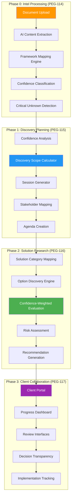
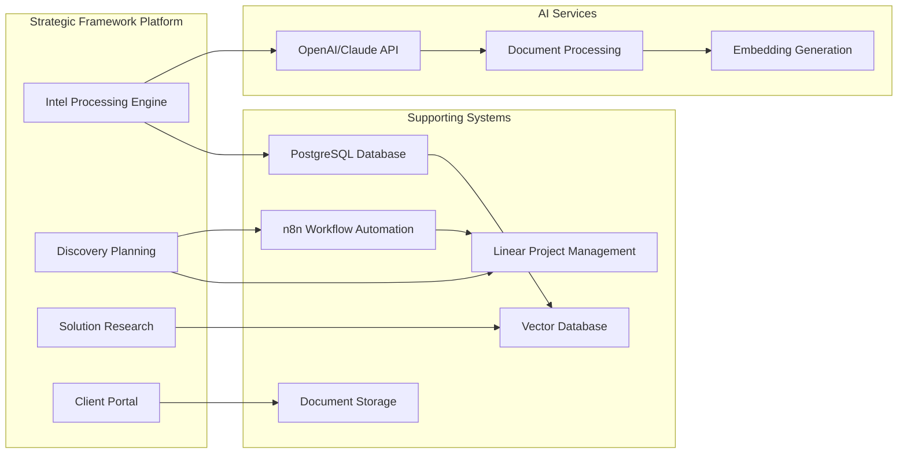

# Strategic Technology Research Framework - Technical Architecture
*Complete Technical Specification for Platform Development*

## 🏗️ **System Architecture Overview**

The Strategic Technology Research Framework automation platform consists of four integrated phases that systematically transform manual technology selection into an automated, confidence-driven process.



---

## 🗄️ **Database Schema Design**

### **Core Framework Data Model**

```sql
-- Framework Assessments (Main Project Container)
CREATE TABLE framework_assessments (
    id UUID PRIMARY KEY,
    client_id UUID NOT NULL,
    project_name VARCHAR(255) NOT NULL,
    status ENUM('intel_processing', 'discovery_planning', 'discovery_active', 'solution_research', 'recommendations', 'implementation') DEFAULT 'intel_processing',
    created_at TIMESTAMP DEFAULT CURRENT_TIMESTAMP,
    updated_at TIMESTAMP DEFAULT CURRENT_TIMESTAMP,
    completed_at TIMESTAMP NULL
);

-- Framework Sections (Structured Framework Data)
CREATE TABLE framework_sections (
    id UUID PRIMARY KEY,
    assessment_id UUID REFERENCES framework_assessments(id),
    section_type ENUM('problem_space', 'scale_reality', 'organizational_context', 'technical_requirements') NOT NULL,
    subsection VARCHAR(100) NOT NULL, -- e.g., 'problem_definition', 'scope_boundaries'
    content TEXT,
    confidence_level ENUM('high', 'medium', 'low', 'unknown', 'critical_unknown') NOT NULL,
    intel_source VARCHAR(255), -- Reference to source document/transcript
    assumptions TEXT,
    validation_status ENUM('pending', 'validated', 'refuted', 'updated') DEFAULT 'pending',
    last_updated TIMESTAMP DEFAULT CURRENT_TIMESTAMP,
    created_by UUID -- User who entered/validated this data
);

-- Critical Unknowns (High-Impact Gaps)
CREATE TABLE critical_unknowns (
    id UUID PRIMARY KEY,
    assessment_id UUID REFERENCES framework_assessments(id),
    assumption_statement TEXT NOT NULL,
    impact_if_wrong TEXT NOT NULL,
    current_confidence INTEGER CHECK (current_confidence >= 1 AND current_confidence <= 10),
    validation_priority ENUM('high', 'medium', 'low') NOT NULL,
    validation_method TEXT,
    resolution_status ENUM('unresolved', 'discovery_planned', 'validating', 'resolved') DEFAULT 'unresolved',
    resolution_outcome TEXT,
    created_at TIMESTAMP DEFAULT CURRENT_TIMESTAMP,
    resolved_at TIMESTAMP NULL
);

-- Discovery Sessions (Targeted Validation Activities)
CREATE TABLE discovery_sessions (
    id UUID PRIMARY KEY,
    assessment_id UUID REFERENCES framework_assessments(id),
    session_type ENUM('minimal', 'moderate', 'comprehensive') NOT NULL,
    session_number INTEGER NOT NULL,
    scheduled_date TIMESTAMP,
    duration_minutes INTEGER,
    agenda TEXT,
    stakeholders TEXT[], -- Array of stakeholder names/roles
    target_unknowns UUID[], -- Array of critical_unknown IDs to resolve
    notes TEXT,
    confidence_updates JSONB, -- Changes to framework section confidence levels
    status ENUM('planned', 'in_progress', 'completed', 'cancelled') DEFAULT 'planned'
);

-- Solution Options (Research & Evaluation)
CREATE TABLE solution_options (
    id UUID PRIMARY KEY,
    assessment_id UUID REFERENCES framework_assessments(id),
    option_name VARCHAR(255) NOT NULL,
    solution_category VARCHAR(100),
    vendor VARCHAR(255),
    option_type ENUM('saas', 'on_premise', 'hybrid', 'custom_development', 'low_code') NOT NULL,
    research_data JSONB, -- Structured research findings
    evaluation_scores JSONB, -- Confidence-weighted scores per criteria
    risk_assessment JSONB, -- Risk factors by confidence level
    implementation_complexity ENUM('low', 'medium', 'high') NOT NULL,
    estimated_cost_range VARCHAR(100),
    recommendation_rank INTEGER,
    recommendation_rationale TEXT,
    created_at TIMESTAMP DEFAULT CURRENT_TIMESTAMP
);

-- Intel Sources (Document Tracking)
CREATE TABLE intel_sources (
    id UUID PRIMARY KEY,
    assessment_id UUID REFERENCES framework_assessments(id),
    source_type ENUM('transcript', 'proposal', 'chat_log', 'document', 'interview_notes') NOT NULL,
    filename VARCHAR(255),
    upload_date TIMESTAMP DEFAULT CURRENT_TIMESTAMP,
    file_path VARCHAR(500), -- Storage location
    processing_status ENUM('uploaded', 'processing', 'processed', 'error') DEFAULT 'uploaded',
    extraction_results JSONB, -- AI extraction outputs
    framework_mappings JSONB -- Which framework sections were populated from this source
);

-- Implementation Tracking (Assumption Validation)
CREATE TABLE implementation_tracking (
    id UUID PRIMARY KEY,
    assessment_id UUID REFERENCES framework_assessments(id),
    assumption_id UUID REFERENCES critical_unknowns(id),
    predicted_outcome TEXT,
    actual_outcome TEXT,
    variance_analysis TEXT,
    accuracy_score INTEGER CHECK (accuracy_score >= 1 AND accuracy_score <= 10),
    lessons_learned TEXT,
    framework_improvement_suggestions TEXT,
    recorded_at TIMESTAMP DEFAULT CURRENT_TIMESTAMP
);
```

---

## 🤖 **AI Processing Pipeline Architecture**

### **Intel Processing Engine (Phase 0)**

```python
# AI Processing Workflow
class IntelProcessingEngine:
    def __init__(self):
        self.ai_client = OpenAIClient()
        self.framework_mapper = FrameworkMappingEngine()
        self.confidence_classifier = ConfidenceClassifier()
    
    async def process_document(self, document_id: str) -> FrameworkAssessment:
        """Complete intel processing pipeline"""
        
        # 1. Content Extraction
        content = await self.extract_content(document_id)
        
        # 2. Entity Recognition
        entities = await self.extract_entities(content)
        
        # 3. Framework Mapping
        framework_data = await self.map_to_framework(content, entities)
        
        # 4. Confidence Classification
        confidence_levels = await self.classify_confidence(framework_data)
        
        # 5. Critical Unknown Detection
        critical_unknowns = await self.detect_critical_unknowns(framework_data, confidence_levels)
        
        # 6. Structured Output Generation
        return await self.generate_assessment(framework_data, confidence_levels, critical_unknowns)

# Framework Mapping Prompts
FRAMEWORK_MAPPING_PROMPTS = {
    "problem_space": """
    Extract problem definition, scope boundaries, success criteria, and user actors from this content.
    Format as structured data with confidence indicators for each element.
    """,
    
    "scale_reality": """
    Identify current user counts, volume/transaction data, growth projections, and economic constraints.
    Flag any numerical estimates with confidence levels.
    """,
    
    "organizational_context": """
    Extract technical capability, budget parameters, change capacity, and priority matrix information.
    Assess confidence based on specificity and validation in the content.
    """,
    
    "technical_requirements": """
    Map existing systems, required integrations, technical constraints, and compliance requirements.
    Identify gaps where assumptions are being made vs. explicitly stated.
    """
}
```

### **Discovery Planning Algorithm (Phase 1)**

```python
class DiscoveryPlanningEngine:
    def calculate_discovery_scope(self, assessment: FrameworkAssessment) -> DiscoveryPlan:
        """Confidence-based discovery scope calculation"""
        
        critical_unknowns = assessment.get_critical_unknowns()
        confidence_distribution = assessment.get_confidence_distribution()
        
        # Discovery Decision Logic
        if len(critical_unknowns) == 0 and confidence_distribution['high'] > 0.8:
            return DiscoveryPlan(scope='skip', rationale='High confidence across framework')
        
        elif len(critical_unknowns) <= 2 and confidence_distribution['medium'] > 0.6:
            return DiscoveryPlan(
                scope='minimal', 
                duration_weeks=1,
                session_count=1,
                focus_areas=critical_unknowns
            )
        
        elif len(critical_unknowns) <= 5 and confidence_distribution['low'] < 0.4:
            return DiscoveryPlan(
                scope='moderate',
                duration_weeks=3,
                session_count=3,
                focus_areas=self.prioritize_unknowns(critical_unknowns)
            )
        
        else:
            return DiscoveryPlan(
                scope='comprehensive',
                duration_weeks=6,
                session_count=5,
                focus_areas=self.full_validation_plan(assessment)
            )
    
    def generate_session_agenda(self, unknowns: List[CriticalUnknown]) -> SessionAgenda:
        """Auto-generate targeted discovery session agendas"""
        
        agenda = SessionAgenda()
        
        for unknown in unknowns:
            agenda.add_validation_questions(
                assumption=unknown.statement,
                validation_method=unknown.validation_method,
                target_stakeholders=self.identify_stakeholders(unknown),
                success_criteria=unknown.resolution_criteria
            )
        
        return agenda
```

---

## 🎯 **Client Portal Interface Design**

### **Portal Navigation Structure**

```mermaid
graph TD
    A[Client Portal Dashboard] --> B[Project Overview]
    A --> C[Intel Submission]
    A --> D[Discovery Planning]
    A --> E[Solution Review]
    A --> F[Implementation Tracking]
    
    B --> B1[Progress Timeline]
    B --> B2[Current Phase Status]
    B --> B3[Next Steps]
    
    C --> C1[Document Upload]
    C --> C2[AI Extraction Review]
    C --> C3[Framework Validation]
    
    D --> D1[Discovery Plan Review]
    D --> D2[Session Scheduling]
    D --> D3[Stakeholder Coordination]
    
    E --> E1[Solution Options]
    E --> E2[Decision Logic]
    E --> E3[Recommendation Rationale]
    
    F --> F1[Assumption Tracking]
    F --> F2[Implementation Progress]
    F --> F3[Outcome Validation]
```



### **Key Portal Features**

**Intel Submission Interface:**
- Drag-and-drop document upload with progress indicators
- Real-time AI processing status with estimated completion time
- Interactive framework review showing extracted vs. validated information
- Confidence level adjustment controls for client validation

**Discovery Coordination:**
- Discovery plan presentation with scope rationale
- Interactive calendar for session scheduling
- Stakeholder availability collection forms
- Pre-session briefing materials and agendas

**Solution Transparency:**
- Interactive decision matrix showing criteria weighting
- Confidence impact visualization on recommendations
- Alternative scenario modeling ("what if" analysis)
- Implementation planning with risk mitigation strategies

---

## 🔄 **Integration Architecture**

### **External System Connections**



### **Workflow Automation Points**

**n8n Integration Triggers:**
- New framework assessment creation → Linear project setup
- Discovery plan completion → Calendar integration for scheduling
- Solution recommendations ready → Client notification and portal update
- Implementation milestone reached → Assumption validation reminder

**Linear Project Management:**
- Automatic issue creation for each Critical Unknown
- Discovery session planning and execution tracking
- Solution research task management
- Implementation milestone and outcome tracking

---

## 📊 **MVP Development Phases**

### **Phase 1: Core Intel Processing (2-3 weeks)**
- Document upload and storage system
- AI content extraction pipeline
- Framework mapping engine with confidence classification
- Critical Unknown detection algorithm
- Basic review interface for validation

### **Phase 2: Discovery Planning (2-3 weeks)**
- Confidence-based discovery scope calculator
- Session agenda generation system
- Stakeholder mapping and coordination tools
- Discovery session management interface

### **Phase 3: Solution Research Engine (3-4 weeks)**
- Solution category mapping system
- Confidence-weighted evaluation framework
- Risk assessment algorithms
- Recommendation generation and ranking

### **Phase 4: Client Portal Integration (2-3 weeks)**
- Client-facing dashboard and navigation
- Progress tracking and timeline visualization
- Review and validation interfaces
- Communication and notification systems

### **Total MVP Timeline: 9-13 weeks**

---

## 🎯 **Success Metrics & KPIs**

### **Processing Efficiency:**
- Intel processing time: Raw documents → structured assessment < 10 minutes
- Framework completion rate: 85%+ of framework sections populated from intel
- Confidence accuracy: AI confidence classifications match human review 80%+ of time

### **Discovery Optimization:**
- Discovery targeting accuracy: 90%+ of Critical Unknowns resolved in planned sessions
- Discovery time reduction: 50% reduction vs. comprehensive discovery for high-confidence cases
- Session effectiveness: 80%+ of planned validation objectives achieved per session

### **Decision Quality:**
- Recommendation accuracy: 85%+ of implementations validate initial recommendations
- Risk prediction: 80%+ of flagged risks materialize as predicted
- Client satisfaction: 90%+ satisfaction with decision transparency and rationale

### **Platform Adoption:**
- Client engagement: 3+ portal visits per week during active engagements
- Team efficiency: 75% reduction in manual framework application time
- Scalability: Support 5+ concurrent client engagements per team member

This technical architecture provides the complete foundation for building the Strategic Technology Research Framework automation platform!